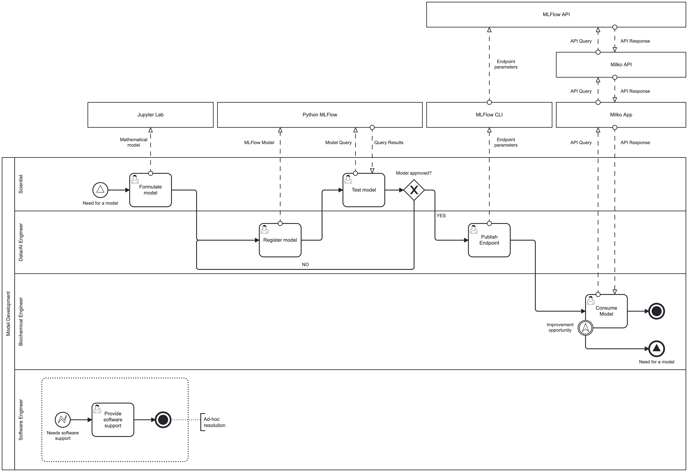

# Cream Cheese Fermentation Explorer

This repository contains documentation about the pH trajectory over the 
fermentation of cream cheese.

The code can be extended to any other ODE model though. 

Each folder has their own README.md file with more information about its purpose 
and contents.

## Business process 
This is the business process covered by this repository.



> Read the full documentation about the business process in the [bpmn/README.md](./bpmn/README.md) file.

## Requirements 

* [python](https://www.python.org/downloads/) >= 3.12
* Node.js 26.4.0
* NPM 11.17.0

## Installation

Please run:

```bash
python -m venv .venv --prompt "Fonterra SWE"
source .venv/bin/activate
pip install -r requirements.txt
```

## Applications 
You can enable applications on the terminal and visit them on your browser.

### Jupyter Lab
The contents of the `models` folder can be explored and executed using Jupyter 
Lab. To enable it, please run:

```bash
jupyter lab
```
Jupyter lab will be available at [http://localhost:8888/lab](http://localhost:8888/lab). 
Then you can navigate to the `models/cream_cheese_fermentation` folder and explore 
the different notebooks and files.

> More information about Jupyter Lab can be found [here](https://jupyter.org/).

### MLFlow
MLFlow is used to deploy the model and make it available for consumption. 
To enable it, please run:

```bash
mkdir -p mlflow
mlflow ui --backend-store-uri sqlite:///mlflow/mlflow.db --default-artifact-root ./mlflow/artifacts
```
MLFlow will be available at [http://localhost:5000](http://localhost:5000) and 
the `mflow` folder will be used to store the models and their metadata.

#### Registering a model
The `/models/cream_cheese_fermentation/cream_cheese_fermentation_registry.ipynb` 
notebook contains the code to register a model in MLFlow. Please make sure that MLFlow is running before executing the notebook.

#### Publish a model
After registering a model in MLFlow, it can published to the MLFlow REST API, with 
the following command:

```bash
cd mlflow # from the root of the repo
MODEL_NAME="Cream_Cheese_Fermentation" # Your model name
PORT=8001 # The port to serve the model
VERSION_NUMBER=latest # The version number of the model to serve (can be a specific version number or "latest")
mlflow models serve -m "models:/$MODEL_NAME/$VERSION_NUMBER" --port $PORT --env-manager local
``` 
example (Cream Cheese Fermentation model):

```bash
cd mlflow # from the root of the repo
mlflow models serve -m "models:/Cream_Cheese_Fermentation/latest" --port 8001 --env-manager local
```
#### Consuming a model
A published model can be consumed at `http://127.0.0.1:8001/invocations` (or 
the port you specified) using a POST request a payload.

Example (Cream Cheese Fermentation model):

```bash
curl -X POST http://127.0.0.1:8001/invocations \
     -H "Content-Type: application/json" \
     -d '{
       "dataframe_records": [
         {
           "y0": [10000000.0, 0.00001],
           "t_start": 0.0,
           "t_end": 12,
           "t_steps": 1000
         }
       ],
       "params": {
         "c1": 5,
         "c2": 12,
         "mu": 1.0,
         "q": -16
       }
     }'
```

### Milko

##### Authentication

##### Skip authentication
on `.env.local`, set the following variable to skip authentication:

```bash
SKIP_AUTH=true
```

##### Microsoft Azure Entra ID authentication
The API and the backend are protected with Entra ID authentication, so you will 
need to create an Entra ID application and configure it to allow access to the 
API (see references). Being a simple project, the applications expect two roles 
to be created in the Entra ID application:

* `analyst`: Basically can access Milk Quality Predictor assets.
* `visitor`: Can see everything, but cannot access Milk Quality Predictor assets.

You can create and configure the application in the Azure Portal at [Entra ID > App registrations](https://portal.azure.com/#view/Microsoft_AAD_IAM/ActiveDirectoryMenuBlade/~/RegisteredApps). 

>Profile edition and role management are federated to Microsoft Entra ID, so I 
>didn't find them a priority to implement in the project. However, it could be 
>done.

## Apps

### API
The API is built with FastAPI, and it is the backend of the project. API is 
located in the `api` folder.

#### Requirements

* Python 3.12.0

#### Installation

##### Python environment

```bash
cd api
python3 -m venv .env --prompt "Milko API"
source .env/bin/activate
pip install -r requirements.txt
```
##### Microsoft Azure Entra ID authentication
The API is protected with Entra ID authentication, so you will need to create an
Entra ID application and configure it to allow access to the API (see references).

After creating the application, you will need to set the following environment
variables in the `.env.local` file:

```bash
TENANT_ID=<your-entra-id-tenant-id>
APP_CLIENT_ID=<your-entra-id-client-id>
```

#### Execution

```bash
fastapi dev
```
Will be available at `http://localhost:8000`.
> You can also access the API documentation at `http://localhost:8000/docs`

### Frontend
The frontend is built with React, and it is the user interface of the project. The frontend is located in the `frontend` folder.

#### Requirements
* Node.js >= 20.6.0

#### Installation

##### Next.js environment

```bash
cd frontend
npm install
```
##### Microsoft Azure Entra ID authentication
The frontend is protected with Entra ID authentication, so you will need to 
create an Entra ID application and configure it to allow access to the frontend 
(see references). After creating the application, you will need to set the following environment variables in the `.env.local` file:

```bash
AUTH_MICROSOFT_ENTRA_ID_ID=<your-entra-id-client-id>
AUTH_MICROSOFT_ENTRA_ID_SECRET=<your-entra-id-client-secret>
AUTH_MICROSOFT_ENTRA_ID_ISSUER=<your-entra-id-issuer>
AUTH_SECRET=<your-secret>
```

You can generate a secret with the following command:

```bash
openssl rand -base64 64
```

##### Models
Integrate the Milko API in the following way:

```bash
MILKO_API_URL=http://127.0.0.1:8000 #Your Milko API URL
CREAM_CHEESE_FERMENTATION_MODEL=/models/Cream_Cheese_Fermentation/latest #Your MLFlow /models/<model name>/<version|latest>
```

#### Execution

```bash
npm run dev
```
Will be available at `http://localhost:3000`.
